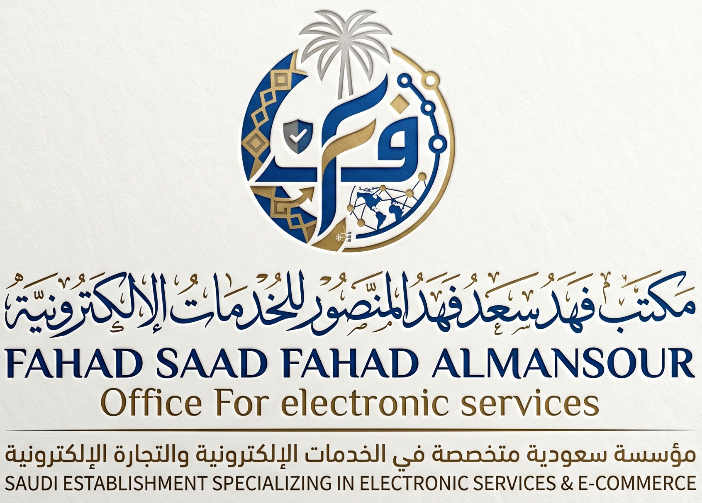
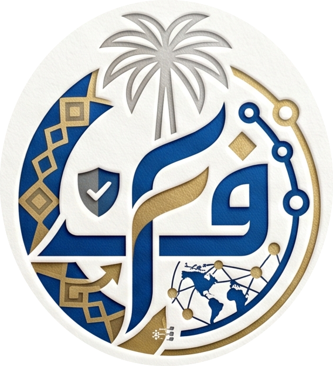

<div align="center">

# Fahad Saad Fahad Almansour
### مكتب فهد سعد فهد المنصور للخدمات الإلكترونية



**Saudi Establishment · Electronic Services & E-Commerce**  
CR #7053130576 · [fahadalmansour.site](https://fahadalmansour.site)

</div>

---

## Table of Contents

- [Overview](#overview)
- [Logo — Gold Premium](#logo--gold-premium)
- [Badge Design](#badge-design)
- [Color Palette](#color-palette)
- [Typography](#typography)
- [All 6 Logo Variants](#all-6-logo-variants)
- [File Inventory](#file-inventory)
- [Interactive SVG Usage](#interactive-svg-usage)
- [Technical Process](#technical-process)
- [Brand Guidelines](#brand-guidelines)
- [Business Information](#business-information)

---

## Overview

This repository is the **brand identity & logo system** for Fahad Saad Fahad Almansour, a Saudi establishment specialising in electronic services and e-commerce. It contains:

- A complete **interactive SVG logo** with 4 independently movable elements
- **6 colour-theme variants** of the same vector artwork
- Full-resolution **PNG exports** of the badge and complete logo
- A **master SVG** file for use in design tools
- Source for the **fahadalmansour.site** website

---

## Logo — Gold Premium

> The selected primary brand variant.

<div align="center">

</div>

The **Gold Premium** theme uses a near-black warm background (`#0D0800`) with every element rendered in deep gold (`#E8C860`) and bright pale gold (`#FFF0A0`), conveying luxury, prestige, and heritage.

Open the interactive version in any browser:

```bash
open fahad_almansour_logo_gold.html
```

---

## Badge Design

<div align="center">

</div>

The circular emblem is split into two halves, each with a distinct meaning:

| Side | Visual | Meaning |
|------|--------|---------|
| **Left** | Islamic geometric diamond lattice | Heritage · Saudi identity · tradition |
| **Right** | Globe with network connection nodes | Technology · digital reach · e-commerce |

### Elements inside the badge

| Element | Description |
|---------|-------------|
| **ف** (Fa) | Large gold Arabic calligraphy — initial of Fahad |
| **Palm tree** | Saudi national symbol, at the apex of the badge |
| **Globe** | Represents international digital presence |
| **Geometric border** | Diamond-lattice ring in gold on deep navy |
| **Outer ring** | 3 concentric gold strokes + 24 diamond polygons at 15° intervals |

---

## Color Palette

| Swatch | Role | Name | Hex | RGB |
|--------|------|------|-----|-----|
| 🟦 | Primary | Deep Navy | `#0E3B72` | 14, 59, 114 |
| 🟡 | Accent | Gold | `#C8A848` | 200, 168, 72 |
| 🌕 | Highlight | Pale Gold | `#FFF0A0` | 255, 240, 160 |
| ⬛ | Dark BG | Midnight Brown | `#0D0800` | 13, 8, 0 |
| ⬜ | Light BG | White | `#FFFFFF` | 255, 255, 255 |
| 🟫 | Badge BG Dark | Warm Black | `#3A1A00` → `#0D0500` | gradient |

### Gold Premium palette (active theme)

```
Background:   #0D0800  ████████
Badge inner:  #3A1A00 → #0D0500  (radial gradient)
Layer 1 fill: #E8C860  ████████  (deep gold — replaces navy)
Layer 2 fill: #FFF0A0  ████████  (bright pale gold)
Ring strokes: #FFF0A0  ████████
Card border:  #C8A030  ████████
```

---

## Typography

| Usage | Typeface | Weight | Style |
|-------|----------|--------|-------|
| Arabic title | Traditional Arabic calligraphy (rendered as vector paths) | Bold | Calligraphic |
| English name | Serif / Times-style (rendered as vector paths) | Bold | Upright |
| English subtitle | Serif italic | Regular | Italic |
| English footer | Sans-serif | Regular | Upright |

> All text is **vectorised** — rendered as SVG bezier paths traced from the original artwork, not live text nodes. This ensures pixel-perfect rendering at any scale with no font dependency.

---

## All 6 Logo Variants

<div align="center">

</div>

Open `fahad_logo_variants.html` to see all variants side-by-side.

```bash
open fahad_logo_variants.html
```

| # | Theme | Background | Badge / Text Fill | Status |
|---|-------|-----------|-------------------|--------|
| 1 | **Classic** | `#FFFFFF` White | Navy `#0E3B72` + Gold `#C8A848` | Reference |
| 2 | **Dark Navy** | `#0A1E3A` | Light blue `#C8D8F0` + Gold `#E8C860` | Alternate |
| 3 | **Midnight Black** | `#0D0D0D` | Steel `#8AABCC` + Gold `#C8A848` | Alternate |
| 4 | **Gold Premium** | `#0D0800` | Gold `#E8C860` + Pale gold `#FFF0A0` | ⭐ **Primary** |
| 5 | **Slate Grey** | `#F0F2F5` | Dark navy `#2C3E6B` + Bronze `#8B6914` | Light alt |
| 6 | **Emerald** | `#F5FFF8` | Forest `#0A3D2B` + Gold `#B8962A` | Light alt |

---

## File Inventory

```
fahad/
├── README.md                              ← this file
│
├── logo_full.png                          ← Full logo, white bg  (3.4 MB)
├── badge_logo.png                         ← Isolated badge       (573 KB)
├── logo_text.png                          ← Text bands only      (1.2 MB)
├── logo.svg                               ← Master SVG vector    (167 KB)
│
├── fahad_almansour_logo_gold.html         ← ⭐ Gold Premium interactive SVG
├── fahad_almansour_logo_interactive.html  ← Classic interactive SVG
├── fahad_logo_variants.html              ← All 6 variants showcase (574 KB)
│
├── brand_kit/                             ← Complete brand kit
│   ├── favicon/                           ← 9 favicon sizes + .ico
│   ├── profile/                           ← 8 social profile pictures
│   ├── headers/                           ← 5 social media covers
│   ├── watermarks/                        ← 5 watermark variants
│   └── email/                             ← Email template + signature
│       ├── email_template.html            ← Full HTML business email
│       └── email_signature.html           ← Compact signature block
│
└── fahad-almansour.com/                   ← Website source
    └── README.md
```

### Asset quick-reference

| Need | File |
|------|------|
| Print / large format | `logo_full.png` |
| Favicon / icon | `badge_logo.png` |
| Design tool (Figma, Illustrator) | `logo.svg` |
| Dark background use | `fahad_almansour_logo_gold.html` → Export PNG |
| All colour options | `fahad_logo_variants.html` |

---

## Interactive SVG Usage

Both `fahad_almansour_logo_gold.html` and `fahad_almansour_logo_interactive.html` open directly in any modern browser with no server required.

### Features

| Feature | Detail |
|---------|--------|
| **Drag badge** | Click and drag the circular emblem freely |
| **Drag Arabic title** | Reposition the Arabic calligraphy line independently |
| **Drag English text** | Move the English name + subtitle block |
| **Drag footer** | Move the Arabic/English footer text |
| **Reset** | One click snaps all 4 elements back to original positions |
| **Download SVG** | Exports the current layout as a clean `.svg` file |
| **Download PNG** | Exports a 2× high-res raster at 1800 × 1520 px |
| **Touch support** | Works on mobile and tablet with touch drag |

### Keyboard / mouse

```
Drag element   →  mousedown + move
Release        →  mouseup
Reset layout   →  click ↺ Reset button
Export SVG     →  click ↓ SVG button
Export PNG     →  click 📷 PNG button
```

---

## Technical Process

The logo SVG was produced entirely programmatically from the source PNG artwork:

### Step 1 — Color extraction
```python
# Separate pixels into colour layers using NumPy thresholding
gold  = (R>140) & (G>95) & (B<130) & (R-B>55)   # warm amber tones
navy  = (B>G) & (R<130) & (B>30) & (brightness<170)  # cool dark blue
dark  = brightness < 60                               # near-black
```

### Step 2 — Potrace vectorisation
```bash
potrace layer_gold.bmp --svg -o gold.svg \
  --turdsize 2 --alphamax 0.8 --opttolerance 0.1
```

Each colour layer produces smooth bezier paths with:
- **60 gold paths** (badge)
- **54 navy paths** (badge)
- **101 text paths** across 3 text bands

### Step 3 — Layer assembly
```svg
<g clip-path="url(#bc)">
  <circle ... fill="url(#bgr)"/>        <!-- radial gradient background -->
  <g fill="#E8C860">                    <!-- navy layer → gold fill -->
    <g transform="...potrace transform...">
      <path d="..."/>  × 54
    </g>
  </g>
  <g fill="#FFF0A0">                    <!-- gold layer → pale gold fill -->
    <path d="..."/>  × 60
  </g>
</g>
```

### Step 4 — Outer ring decoration
```python
# 24 diamond polygons at 15° intervals around the circle
for i in range(24):
    angle = math.radians(i * 15 - 90)
    x = cx + (r + 24) * math.cos(angle)
    y = cy + (r + 24) * math.sin(angle)
    # draw 5px diamond polygon at (x, y) rotated by i*15°
```

### Step 5 — Potrace coordinate mapping
Potrace outputs paths in a flipped coordinate system. The transform chain to map them correctly into SVG space:

```
outer group:  translate(badge_tx, badge_ty) scale(SCALE_B)
inner group:  translate(0, BH) scale(0.1, -0.1)
```

Where `SCALE_B = 200 / 244` (scaling badge to 200px radius in SVG).

### Step 6 — Drag interactivity
```javascript
function drag(el) {
  // scale-aware: converts screen pixels → SVG user units
  function move(cx, cy) {
    const [scx, scy] = getScale();   // viewBox / clientRect ratio
    el.setAttribute('transform',
      `translate(${ox+(cx-sx)*scx}, ${oy+(cy-sy)*scy})`);
  }
}
```

---

## Brand Guidelines

### Do ✅
- Use the **Gold Premium** variant on dark backgrounds
- Use the **Classic** variant on white / light backgrounds
- Keep the badge circle uncropped
- Export at minimum **300 DPI** for print (use `logo.svg` → export from design tool)
- Use the `logo.svg` master for any resizing

### Don't ❌
- Don't stretch or skew the logo non-proportionally
- Don't place the logo on busy photographic backgrounds without a solid backing shape
- Don't change individual element colours without exporting a new variant from the HTML
- Don't use rasterised PNGs below 100px width (use SVG instead)

### Clear space
Maintain a minimum clear space around the logo equal to the height of the **ف** letter (~20% of badge diameter).

---

## Brand Kit

A complete set of ready-to-use assets is in `brand_kit/`. All assets use the **Gold Premium** colour scheme.

### Favicons (`brand_kit/favicon/`)
| File | Size | Use |
|------|------|-----|
| `favicon-16x16.png` | 16×16 | Browser tab |
| `favicon-32x32.png` | 32×32 | Browser tab (HiDPI) |
| `favicon-48x48.png` | 48×48 | Windows taskbar |
| `favicon-64x64.png` | 64×64 | Browser bookmark |
| `favicon-128x128.png` | 128×128 | Chrome web store |
| `favicon-180x180.png` | 180×180 | Apple Touch Icon |
| `favicon-192x192.png` | 192×192 | Android Chrome |
| `favicon-512x512.png` | 512×512 | Android splash |
| `favicon.ico` | 16/32/48 | Universal browser favicon |

### Social Media Profile Pictures (`brand_kit/profile/`)
| File | Size | Platform |
|------|------|----------|
| `profile-twitter-400x400.png` | 400×400 | Twitter / X |
| `profile-instagram-320x320.png` | 320×320 | Instagram |
| `profile-facebook-170x170.png` | 170×170 | Facebook |
| `profile-linkedin-400x400.png` | 400×400 | LinkedIn |
| `profile-youtube-800x800.png` | 800×800 | YouTube |
| `profile-whatsapp-640x640.png` | 640×640 | WhatsApp Business |
| `profile-snapchat-320x320.png` | 320×320 | Snapchat |
| `profile-tiktok-200x200.png` | 200×200 | TikTok |

### Social Media Headers (`brand_kit/headers/`)
| File | Size | Platform |
|------|------|----------|
| `header-twitter-1500x500.png` | 1500×500 | Twitter / X cover |
| `header-facebook-820x312.png` | 820×312 | Facebook cover |
| `header-linkedin-1584x396.png` | 1584×396 | LinkedIn personal cover |
| `header-linkedin-company-1128x191.png` | 1128×191 | LinkedIn company cover |
| `header-youtube-2560x1440.png` | 2560×1440 | YouTube channel art |

### Watermarks (`brand_kit/watermarks/`)
| File | Opacity | Use |
|------|---------|-----|
| `watermark-badge-dark-30.png` | 30% | Overlay on light backgrounds |
| `watermark-badge-light-30.png` | 30% | Overlay on dark backgrounds |
| `watermark-badge-gold-50.png` | 50% | Documents and presentations |
| `watermark-text-dark-25.png` | 25% | Subtle text watermark |
| `watermark-full-30.png` | 30% | Full logo watermark |

### Email Templates (`brand_kit/email/`)
| File | Description |
|------|-------------|
| `email_template.html` | Full HTML business email / newsletter — table-based, 600px, Gold Premium, badge embedded as base64 |
| `email_signature.html` | Compact signature block — copy-paste into Gmail/Outlook HTML signature editor |

**Email color scheme:**

| Element | Color |
|---------|-------|
| Header / Footer background | `#0D0800` |
| Company name & accent text | `#E8C860` |
| Gold divider lines | `C8A030` |
| Body background | `#FAFAF8` |
| Body text | `#1A1A1A` |
| CTA button | `#C8A030` bg · `#0D0800` text |

Open to preview:
```bash
open brand_kit/email/email_template.html
open brand_kit/email/email_signature.html
```

---

## Business Information

| Field | Detail |
|-------|--------|
| **Name (AR)** | مكتب فهد سعد فهد المنصور للخدمات الإلكترونية |
| **Name (EN)** | Fahad Saad Fahad Almansour — Office For Electronic Services |
| **Tagline (AR)** | مؤسسة سعودية متخصصة في الخدمات الإلكترونية والتجارة الإلكترونية |
| **Tagline (EN)** | Saudi Establishment Specializing in Electronic Services & E-Commerce |
| **Type** | Saudi Establishment (مؤسسة سعودية) |
| **CR** | #7053130576 |
| **Domain** | fahadalmansour.site |
| **SSL** | Active (certificate provisioned) |

---

<div align="center">

© Fahad Saad Fahad Almansour · All rights reserved  
مكتب فهد سعد فهد المنصور للخدمات الإلكترونية

</div>
